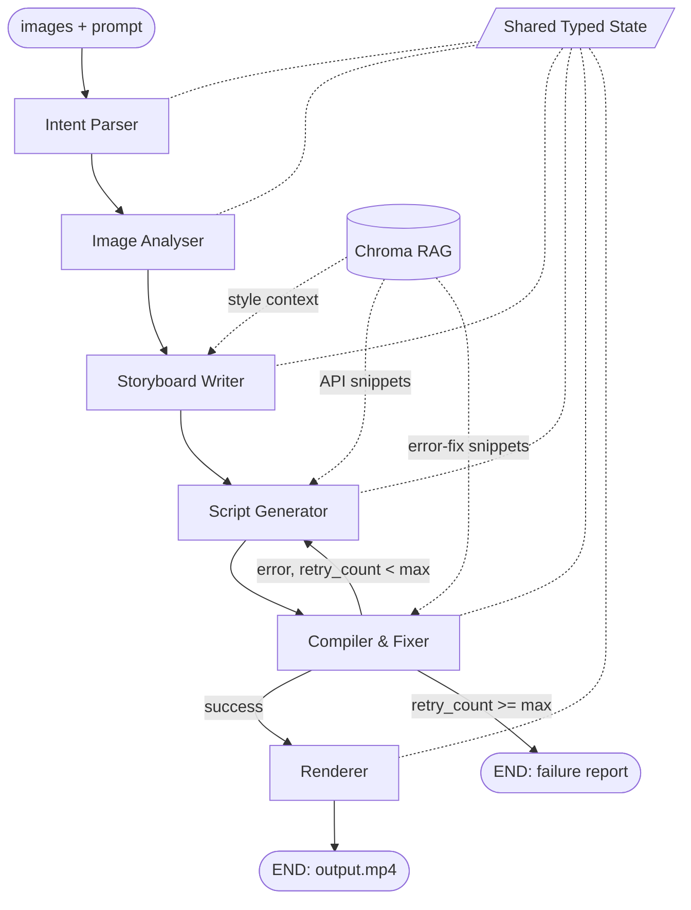

# FotoOwl — Image-to-Video Multiagent Pipeline

An AI-powered video generation pipeline that converts a collection of event photos and a user creative prompt into a fully rendered MP4 video. No human editor. No manual sequencing.

---

## Setup

**Requirements:** Python 3.11+, Node.js 20+

```bash
# 1. Clone the repository
git clone https://github.com/Sanghavi744/fotoowl-pipeline
cd fotoowl-pipeline

# 2. Create and activate virtual environment
python3 -m venv venv
source venv/bin/activate        # Mac/Linux
# venv\Scripts\activate         # Windows

# 3. Install Python dependencies
pip install -r requirements.txt

# 4. Install Node.js via nvm (if not already installed)
curl -o- https://raw.githubusercontent.com/nvm-sh/nvm/v0.39.7/install.sh | bash
source ~/.bashrc
nvm install 20 && nvm use 20

# 5. Install Remotion dependencies
cd remotion_project && npm install && cd ..

# 6. Set up environment variables
cp .env.example .env
# Add your GROQ_API_KEY to .env

# 7. Seed the RAG vector store (one-time)
python -m rag.retriever

# 8. Run tests (no API keys required)
pytest tests/ -v
```

---

## Run

```bash
# Cinematic wedding reel
python main.py --images ./images_small --prompt "Cinematic wedding reel, slow and emotional, warm golden tones, minimal captions"

# Upbeat energetic reel — same images, different output
python main.py --images ./images_small --prompt "Upbeat energetic reel, fast cuts, bold captions, high energy"
```

Output: `./sample_output/output.mp4`

---

## LangGraph Graph



---

## Pipeline Agents

**1. Intent Parser** — Converts the raw user prompt into a structured `VideoIntent` object (pacing, visual style, caption tone, transition preference). Every downstream agent reads from this — not the raw prompt.

**2. Image Analyser** — Analyses each photo and returns scene description, mood, quality score (0–1), and tags. Low-quality images get lower scores and are skipped by the storyboard.

**3. Storyboard Writer** — Retrieves style context from RAG, then picks the best images and sequences them into a narrative arc (opening → build → climax → close) with timing, captions, and transitions.

**4. Script Generator** — Retrieves Remotion API snippets from RAG, then generates a valid TypeScript/TSX composition from the storyboard. On retry passes, the exact compile error is injected as context for targeted fixes.

**5. Compiler & Fixer** — Runs `npx remotion bundle`. On failure, passes the error back to Script Generator. Retries up to `max_retries` times then exits with a structured failure report.

**6. Renderer** — Runs `npx remotion render` to produce the final MP4.

---

## Model Selection Rationale

| Node | Model | Reason |
|---|---|---|
| Intent Parser | Groq LLaMA 3.3 70B | Simple JSON extraction. Fast and free. No vision needed. |
| Image Analyser | Groq LLaMA 3.3 70B | Analyses image context. Free tier with generous limits. |
| Storyboard Writer | Groq LLaMA 3.3 70B | Strong narrative reasoning. Handles structured JSON output well. |
| Script Generator | Groq LLaMA 3.3 70B | Reliable TypeScript output. Retry loop acts as safety net. |
| Compiler & Fixer | subprocess only | Deterministic — either compiles or returns an error string. No LLM needed. |
| Renderer | subprocess only | Deterministic Remotion CLI call. No LLM needed. |

All nodes use Groq's free tier (100,000 tokens/day, 12,000 tokens/min). This makes the pipeline fully free to run.

---

## RAG Design

Two Chroma collections stored locally in `./rag_store/`:

### `style_guides`
- One document per visual style: cinematic, upbeat, corporate.
- **Chunking: whole-document, no splitting.** Each entry describes a gestalt — pacing, colour, caption rules, and transition type must be read together. Splitting into sentences destroys the cross-field coherence that makes the style guide useful.
- Retrieved by `visual_style` from VideoIntent before Storyboard Writer runs.

### `remotion_api`
- One self-contained code snippet per pattern: Sequence+Img, interpolate zoom, caption overlay, Root composition.
- **Chunking: one snippet per chunk, never split mid-function.** Code must be complete to be usable. Splitting a `useCurrentFrame` + `interpolate` example across two chunks makes both halves unusable.
- Retrieved by semantic query before Script Generator writes code. On retry, the compile error itself is used as the query to find the most relevant fix snippet.

---

## Two Prompts → Different Outputs

**Prompt A:** `"Cinematic wedding reel, slow and emotional, warm golden tones, minimal captions"`

→ `VideoIntent: pacing=slow, style=cinematic, captions=emotional, transitions=fade`
→ Storyboard: 5 scenes × 5–6s each, soft emotional captions, fade transitions, zoom-in animations
→ See `sample_output/storyboard_cinematic.json`

**Prompt B:** `"Upbeat energetic reel, fast cuts, bold captions, high energy"`

→ `VideoIntent: pacing=fast, style=upbeat, captions=bold, transitions=cut`
→ Storyboard: scenes × 1–2s each, ALL CAPS bold captions, hard cut transitions
→ See `sample_output/storyboard_upbeat.json`

Same images. Meaningfully different storyboard structure, timing, caption tone, and Remotion script.

---

## Test Suite

```bash
pytest tests/ -v
```

7 tests, all runnable without API keys via mocked LLM calls:

| Test | What it covers |
|---|---|
| `test_intent_parser_cinematic` | Cinematic prompt → correct VideoIntent |
| `test_intent_parser_upbeat` | Upbeat prompt → different VideoIntent |
| `test_retry_routing_on_failure` | Compile error → routes back to script_generator |
| `test_fail_routing_when_max_retries_exceeded` | Max retries → routes to END |
| `test_success_routing_when_compiled` | Compile success → routes to renderer |
| `test_storyboard_writer_produces_valid_storyboard` | Output validates against Pydantic schema |
| `test_llm_judge_storyboard_coherence` | LLM-as-judge scores narrative arc ≥ 6/10 |

---

## Project Structure

```
fotoowl-pipeline/
├── main.py                    # Entry point
├── pipeline.py                # LangGraph graph with conditional retry edge
├── requirements.txt
├── .env.example
├── state/
│   └── schema.py              # Shared typed state — VideoIntent, Storyboard, etc.
├── agents/
│   ├── intent_parser.py       # Prompt → VideoIntent struct
│   ├── image_analyser.py      # LLM → image tags + quality score
│   ├── storyboard_writer.py   # RAG + LLM → storyboard JSON
│   ├── script_generator.py    # RAG + LLM → Remotion TSX
│   ├── compiler_fixer.py      # subprocess compile, captures errors
│   └── renderer.py            # subprocess render → output.mp4
├── rag/
│   └── retriever.py           # Chroma collections, seed data, retrieval helpers
├── utils/
│   └── llm.py                 # Model routing
├── tests/
│   └── test_pipeline.py       # 7 tests with mocked LLMs + LLM-as-judge
├── remotion_project/
│   ├── src/
│   │   ├── index.ts           # Remotion entry point
│   │   ├── Root.tsx           # Composition registration
│   │   └── Composition.tsx    # Generated by Script Generator agent
│   └── public/                # Images served by Remotion
└── sample_output/
    ├── storyboard_cinematic.json
    ├── storyboard_upbeat.json
    ├── remotion_script_cinematic.tsx
    ├── pipeline_state_cinematic.json
    └── output.mp4
```

---

## Sample Output

The `sample_output/` folder contains:
- `storyboard_cinematic.json` — full storyboard for the cinematic prompt
- `storyboard_upbeat.json` — full storyboard for the upbeat prompt
- `remotion_script_cinematic.tsx` — generated Remotion composition
- `pipeline_state_cinematic.json` — complete pipeline state trace
- `output.mp4` — rendered video from the cinematic run ✅

---

## Author

Sanghavi K.
